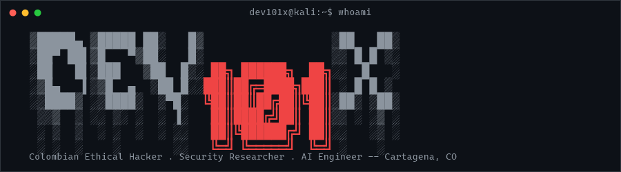
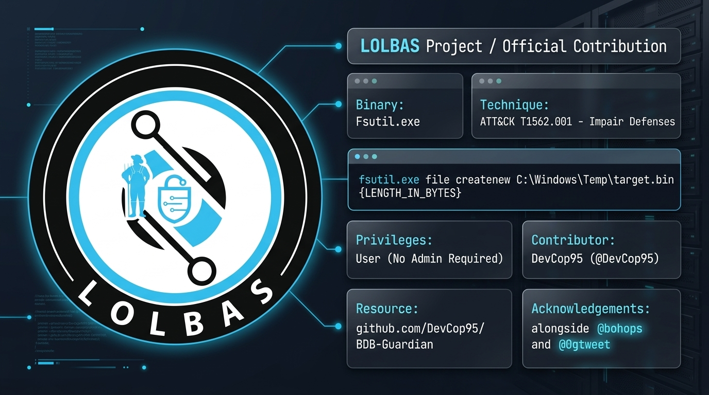
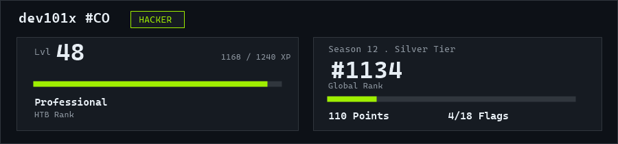

<div align="center">



[](https://dev101x.online/)
[](https://github.com/LOLBAS-Project/LOLBAS/pull/525)
[](https://www.linkedin.com/in/yared-dev)
[](https://hackerone.com/Dev101x)
[](https://x.com/Devcop101)
[](https://github.com/DevCop95)

</div>

---

```bash
dev101x@kali:~$ whoami
```

Colombian Ethical Hacker, Security Researcher and Software Engineer (aka **DevCop95 / Dev101x**), based in **Cartagena, Colombia** 🇨🇴. Currently a Penetration Tester at **Henkel** (Switzerland · Remote), and pursuing a **Master's in Artificial Intelligence at the Universitat de Barcelona**.

Focus: **offensive security, vulnerability research, and autonomous AI agent architectures** — bridging low-level system exploitation with automated intelligence pipelines.

```bash
dev101x@kali:~$ cat focus.txt
```

- 🛡️ **Vulnerability Research:** Authored the Windows `Fsutil.exe` defense-evasion technique in the official [LOLBAS Project (PR #525, merged)](https://github.com/LOLBAS-Project/LOLBAS/pull/525) — [MITRE ATT&CK T1562.001](https://attack.mitre.org/techniques/T1562/001/).
- 🎯 **Offensive Security:** Bug bounty hunter on **HackerOne**; builds automated recon/vuln pipelines and OSINT tooling (see pinned projects below).
- 🤖 **Applied AI:** Security skill layers and LLM integration pipelines (LangChain · Python).
- 🤝 Open to **Red Teaming**, **Applied AI Security**, and technical consulting engagements.

> ⚠️ **Authorized use only.** Every offensive/security tool linked below is built for use in scoped engagements, CTFs, bug bounty programs and environments the operator owns or is authorized to test. None of it is intended for use against systems without explicit permission.

---

## 🛡️ Vulnerability Research & Official Contributions

<div align="center">
  <a href="https://github.com/LOLBAS-Project/LOLBAS/pull/525">
    
  </a>
</div>

| Component | Detail |
|---|---|
| **Binary & Technique** | `Fsutil.exe` — Defense Evasion via 8dot3 Name Creation Tampering |
| **Pull Request** | [LOLBAS-Project/LOLBAS #525 (Merged)](https://github.com/LOLBAS-Project/LOLBAS/pull/525) |
| **MITRE ATT&CK** | [T1562.001: Impair Defenses — Disable or Modify Tools](https://attack.mitre.org/techniques/T1562/001/) |

---

## 🚀 Projects & Security Arsenal

<div align="center">

[](https://github.com/DevCop95/bugbounty-lab101)
<br>
[](https://github.com/DevCop95/bugbounty-lab101/stargazers)
[](https://github.com/DevCop95/bugbounty-lab101/network/members)

<br>

[](https://github.com/DevCop95/shodan_reconsx)
<br>
[](https://github.com/DevCop95/shodan_reconsx/stargazers)
[](https://github.com/DevCop95/shodan_reconsx/network/members)

</div>

| Project | Stack | Description |
|---|---|---|
| 🛡️ [**LOLBAS-Project/LOLBAS**](https://github.com/LOLBAS-Project/LOLBAS/pull/525) | `Official Contributor` · `MITRE T1562.001` | Native Windows binary technique for defense evasion (PR #525, merged) |
| 🏹 [**bugbounty-lab101**](https://github.com/DevCop95/bugbounty-lab101) | `Shell` · `Recon` | Bug bounty workspace: recon/vuln pipeline, report templates, scope enforcement |
| 🧪 [**dev101x-pentest-lab**](https://github.com/DevCop95/dev101x-pentest-lab) | `Docker` · `Python` | Self-contained Pro Lab-style box: blind SQLi → pivot → SUID privesc, with live flag validation |
| 🏦 [**BDB-Guardian**](https://github.com/DevCop95/BDB-Guardian) | `PowerShell` | SecOps / forensics tooling for incident-response simulation |
| 🔍 [**shodan_reconsx**](https://github.com/DevCop95/shodan_reconsx) | `Python` · `Shodan` | OSINT recon framework built on the Shodan API |
| 🤖 [**cyhber-deploy**](https://github.com/DevCop95/cyhber-deploy) | `Python` | Security skill layer for AI coding agents |

</div>

---

## 🛠️ Tech Stack

<div align="center">


</div>

---

## 💼 Experience

| Period | Role | Company |
|---|---|---|
| 2026 — present | 🛡️ Penetration Tester | Henkel · Switzerland (Remote · Part-time) |
| 2022 — 2025 | 🏢 Chief Technology Officer | EXIA S.A.S — Cartagena, CO |
| 2021 — 2024 | 💻 Semi-Senior Developer | Google |
| 2020 — present | 🚀 Freelance · Offensive Security & AI | Independent |

## 🎓 Education

| Period | Degree | Institution |
|---|---|---|
| 2024 — present | 🤖 Master's in Artificial Intelligence | Universitat de Barcelona |
| 2017 — 2021 | 🎓 Systems & Computer Engineering | Universidad Tecnológica de Bolívar |
| 2013 — 2017 | 💡 Systems & Computer Technology | Universidad Tecnológica de Bolívar |

---

## 📊 GitHub Stats

<div align="center">


&nbsp;


</div>

---

## 🎯 HackTheBox

<div align="center">

<a href="https://profile.hackthebox.com/profile/019f8d0f-a8d2-73bb-8f12-d863b7261aa3">
  
</a>

</div>

---

<div align="center">

<i>"Security is not a product, but a process. Code is poetry. Ship it."</i>

<sub>⭐️ From <a href="https://github.com/DevCop95">DevCop95</a> · Colombian Ethical Hacker · Cartagena, Colombia 🇨🇴</sub>

</div>
